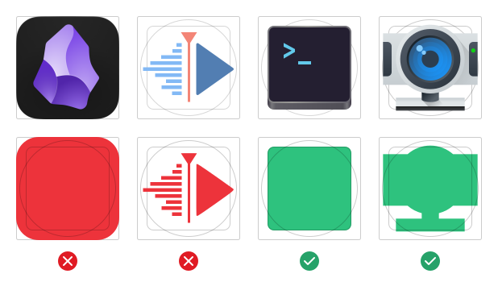
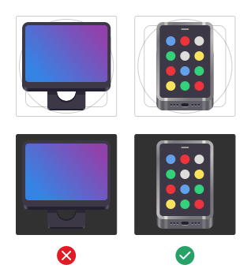
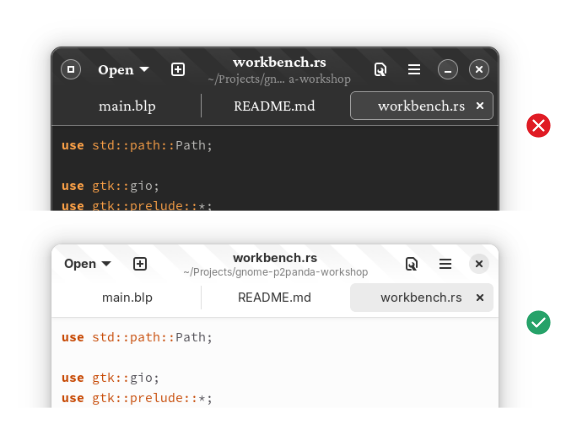
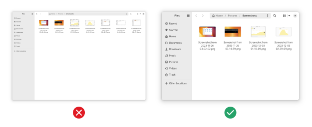
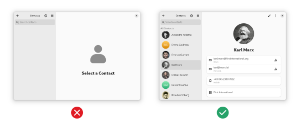

# Quality guidelines

The following guidelines are not required for submission to Flathub, but are best practices we recommend and consider for curation and promotion. These guidelines are designed to help your app and Flathub itself appear in the best light to users—they may change over time based on developer and user feedback.

:::tip
Apps following the quality guidelines may be featured more prominently across Flathub and native app store clients, like on the front page or at the top of category pages.
:::

The term `must` in these guidelines is used in the context of considering whether an app passes the app listing quality checks. Apps that do not follow these guidelines may still be published on Flathub.

For the basics on how to write metadata for your app, see the [Appstream Metadata Quickstart](https://www.freedesktop.org/software/appstream/docs/chap-Quickstart.html).

## General

### No trademark violations

Your app should not violate any trademarks. This includes the name, icon, and summary.

For example, if your app is a Telegram client or web wrapper, it should not be called `Telegram for Linux` or use the official Telegram icon. Instead, it should have its own identity (e.g. `Paper Plane`, with a custom icon). If it's made clear that it's a third-party client it can be ok to mention the original service (e.g. `Tally for Plausible`), but in most cases it should be avoided.

:::tip
If you're not sure if your app violates any trademarks, feel free to ask us on [Matrix](https://matrix.to/#/#flathub:matrix.org).
:::

### Managed by app author

Use Flathub verification to indicate that you are the author of the app and that you are managing the app on Flathub.

## App Icon

### Icon size

The icon should be SVG, or a PNG with a size greater or equal to 256x256 pixels. It has to be square.

### Reasonable footprint

The icon shouldn't fill too much or too little of the canvas. Avoid filling the entire canvas and having the icon touch the edges of the canvas (except with small protruding elements). Similarly, avoid thin shapes that are hard to see.

You can use our icon grid (<a href="/img/app-icon-grid.svg" download>SVG template download</a>) with square and circular base shapes
to check if your icon's footprint is too large or too small. The examples below show
the grid overlaid on some app icons.



### Good contrast

The icon should have good contrast on dark and light backgrounds. In particular, avoid single-color glyphs and the like since they can be very hard to see if the background color is similar. Dark colors near the edges are also a problem, since shadows don't help much with contrast on dark backgrounds.



### Not too much or too little detail

The icon should be recognizable at small sizes. Avoid too many tiny details, small text, and generally try and match other well-executed app icons in terms of complexity. Icons should also be complex enough to be recognizable, e.g. a flat single-colored symbol is too simple.


### No baked-in shadows

The icon should not have any baked-in shadows or glows. Both the Flathub website and native stores apply a shadow to all icons, so baked-in shadows result in double shadows or other glitches.

### In line with contemporary styles

The icon should be somewhat in line with the contemporary icon styles (i.e. not look like it hasn't been updated in decades). The [GNOME](https://developer.gnome.org/hig/guidelines/app-icons.html) and [KDE ](https://develop.kde.org/hig/style/icons/colorful/application/) app icon guidelines are examples of the kind of style your icon should align with.


In some cases, it can make sense for the icon to align with the visuals of the app, rather than contemporary icon styles (especially relevant for games). This can be accommodated by embedding the custom style icon in one of the grid shapes, e.g. a square or circle. This way the unique style is preserved, but the icon's size and shape are in line with other apps.

## App Name

### Not too long

The name should ideally be no longer than 15 characters, and must be shorter than 20 characters.

:::danger Bad examples

- Apostrophe Markdown
- Minimal Markdown Editor
  :::

### Just the name

The name should be just the name, without any additional info. For example, don't append what the app does to the name, and use the summary to provide this extra information instead.

:::danger Bad examples

- Apostrophe - Markdown Editor
- Apostrophe (Markdown Editor)
- Apostrophe (Special Edition)
  :::

### No weird formatting

The name should not have any weird formatting or punctuation. For example, it should not be all-lowercase, all-uppercase, camel case, or contain dashes or periods. Cases where the weird formatting is part of the brand are exempt from this (e.g. `VLC`).

:::danger Bad examples

- apostrophe
- APOSTROPHE
- ApostropheEditor
- Apostrophe.org
  :::

## Summary

### Not too long

The summary should ideally be between 10 and 25 characters, and no longer than 35 characters.

:::tip Good example

- Write markdown in style
  :::
  :::danger Bad example

- Simple, easy to use, distraction-free markdown editor written in Python
  :::

### Not technical

The summary should be understandable by a non-technical person, and not contain any technical terms. Don't mention the toolkit, programming language, or other implementation details that would not be relevant to a non-developer and explain what the app does for people instead. Don't duplicate metadata that's already available in a different form, such as the license, e.g. by mentioning that the app is "free and open source". Avoid generic nouns like "app", "tool", or "client".

:::danger Bad examples

- GTK4 chat app written in Rust
- An Electron Wrapper for the Telegram Web App
- Free and open source Qt5 Matrix client
  :::

:::tip
There are separate fields for technical information. If you want to mention the toolkit do it in [categories](https://specifications.freedesktop.org/menu-spec/latest/apas02.html) or [keywords](https://www.freedesktop.org/software/appstream/docs/chap-Metadata.html#tag-keywords).
:::

### No weird formatting

The summary should not have any weird formatting or punctuation. It should use sentence case, rather than title case. It shouldn't end with a full stop.

:::danger Bad example

- A Simple Markdown Editor.
  :::

### Don't repeat the name

The summary is usually shown next to the app name, so repeating the name looks bad.

:::danger Bad example

- Apostrophe - A simple markdown editor
  :::

### Don't start with an article

Starting summaries with an article is almost always unnecessary. Instead, either omit the article or ideally phrase it in the imperative with a verb.

:::danger Bad examples

- An image viewer
- The LibreOffice suite
  :::

:::tip Good examples

- View images and videos
- Edit documents
  :::

## Description

### Don't repeat the summary

The description should not just repeat or rephrase the summary. The summary is a kind of slogan or advertisement for the app, while the description should go into more detail about the purpose of the app, which features it has, and what makes it unique.

### Not too short

The description should be substantially longer than the summary. Something like 3-6 lines of text at default line widths (around 70 characters) is a good length for most apps, for very large apps up to about 10 lines.

### No super long lists

Avoid feature lists with more than 10 items, they are difficult to scan and make the app store listing unwieldy. Instead, try to group points or use paragraphs instead of bullet points.

## Screenshots

### At least one screenshot

Apps should have at least one screenshot in English. For medium complexity apps 3-6 is a good range, for very large apps with lots of screens 6-10 is appropriate. More than 10 is probably too many.

:::tip
Your best screenshot should be on the first position, because it will be the first thing a user sees when viewing your app on Flathub.

We might also use this in other places, such as featured banners, so make sure it's a good one.
:::

### Tag screenshots with correct language

Screenshots should be tagged with the language they are in. For example, if you have a screenshot of the app in German, tag it with `xml:lang="de"`.

```xml
  <screenshots>
    <screenshot type="default">
      <image xml:lang="de">https://www.example.com/de/app-name01.jpg</image>
    </screenshot>
  </screenshots>
```

### Just the app window

Use the "window screenshot" feature in your native system screenshot tool to get just the app window and its shadow. Do not include the wallpaper behind the app, or even the entire desktop. Do not edit the screenshot, crop it, add text, or include promotional graphics.


### Take screenshots on Linux

Do not use screenshots taken on other platforms, especially if it's immediately obvious from window controls and the like.

### Default settings

Use the platform default configuration for all settings that affect screenshots, including window controls, interface font, large text, high contrast, dark style, and so on. Having some screenshots to show off that e.g. dark style is supported is fine, but these should not be the only screenshots.



### Include window shadow and rounded corners

Screenshots must include the native toolkit shadow and rounding (if any). App stores do not add a shadow after the fact, and without one, screenshots can look glitchy or have low contrast depending on the background. Apps that are always fullscreen (such as most games) are exempt from this, but in these cases all screenshots must be fullscreen. Do not use a mix of windowed and fullscreen screenshots.

:::tip
Don't maximize your app window when taking screenshots, since this will remove the shadow and rounding.
:::

### Reasonable window size

In order to ensure that text and interface elements are visible scaled-down in the app store UI the window size should be 1000x700 pixels or smaller (2000x1400 for HiDPI).



### Image captions

Every screenshot should have a [caption](https://www.freedesktop.org/software/appstream/docs/chap-Metadata.html#tag-screenshots) briefly describing it. Captions should only be one sentence and not end with a full stop. Don't start them with a number.

### Good content

Screenshots of apps that display content (media viewers, notes apps, chat, social media, and the like) should not show empty states or ugly content. Take some time to select high quality content, it makes all the difference for screenshots.



### Up to date

Screenshots should reflect the current state of the app's interface, not some previous version. If an app update makes visible changes to the interface, screenshots should be updated at the same time.

## Release Notes

### Release notes for every release

Make sure all your releases have release notes, even minor ones.

### Short but informative

Release notes should not be too long, and focus on briefly explaining what changed from a user perspective. 2-3 sentences for medium-sized releases is a good length. For larger releases, avoid endless bullet point lists and rather go with a few paragraphs or a shorter summarized list instead.

### No "bug fixes and performance improvements"

Release notes should include some actual information about what changed rather than just generic boilerplate.

## Age Ratings

### Take easily accessible content into account

Apps acting as "readers" or "stores" for external content should take into account what is accessible by just navigating around in the app. If content of a certain type can be arrived at without searching or typing in URLs, the app should be tagged as containing it. For example, an RSS reader that doesn't feature any content can be "All Ages", but the rating for a manga app with pre-configured servers should reflect the content of those default sources.
